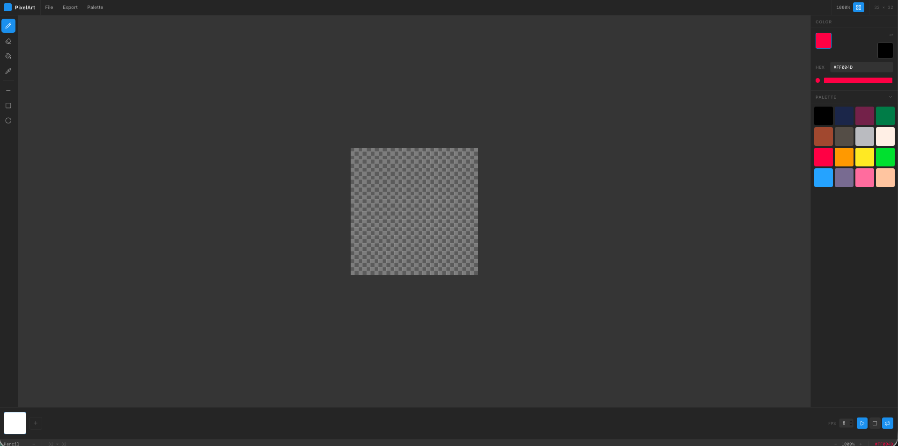

# Pixel Art Editor — Web App

> Implementation of the pixel art editor designed in `../pixel-art-editor.pen`



## Stack

| | |
|---|---|
| Framework | React 19 + Vite |
| Language | TypeScript |
| State | Zustand |
| Styling | Tailwind CSS v4 |
| Icons | lucide-react |
| Color math | colord |
| GIF export | gif.js |
| Canvas | HTML5 Canvas API (raw) |

## Dev Setup

```bash
npm install
npm run dev       # dev server at http://localhost:5173
npm run build     # production build → dist/
npm run preview   # preview production build locally
```

## Project Structure

```
src/
├── main.tsx
├── App.tsx                  # Root layout shell, modal router
├── store/
│   ├── canvasSlice.ts       # Pixel data, layers, canvas size, history
│   ├── toolSlice.ts         # Active tool, tool options
│   ├── paletteSlice.ts      # Active colors, palette sets
│   ├── animationSlice.ts    # Frames, FPS, playback state
│   └── uiSlice.ts           # Zoom, modal state, view mode
├── components/
│   ├── layout/              # TopBar, ToolBar, RightPanel, StatusBar, Timeline
│   ├── canvas/              # CanvasArea, PixelCanvas, Rulers, useCanvasEvents
│   ├── color/               # ColorPicker, ColorSwatch, PaletteGrid
│   ├── timeline/            # FrameStrip, FrameThumb, PlaybackControls
│   └── modals/              # NewProjectModal, ExportModal, PaletteManagerModal
├── tools/                   # pencil, eraser, fill, eyedropper, line, rect, ellipse, select, move
├── engine/
│   ├── PixelBuffer.ts       # Uint8ClampedArray wrapper (core data structure)
│   ├── renderer.ts          # drawFrame, drawGrid, drawCheckerboard
│   ├── history.ts           # Undo/redo snapshot stack
│   └── export.ts            # PNG, GIF, SVG export
├── data/
│   ├── palettes.ts          # PICO-8, NES, GameBoy, C64 color arrays
│   └── presets.ts           # Canvas size presets
└── styles/
    └── index.css            # Design tokens (CSS variables) + Tailwind base
```

## Design Tokens

Colours and dimensions match the Pencil design file exactly:

```css
--bg-base:            #1A1A1A
--bg-surface:         #2A2A2A
--bg-elevated:        #3A3A3A
--bg-canvas-surround: #3D3D3D
--accent:             #1D9BF0
--text-primary:       #F0F0F0
--text-secondary:     #AAAAAA
--text-muted:         #666666
--border:             #444444
--border-subtle:      #333333
--toolbar-width:      48px
--panel-width:        220px
--topbar-height:      40px
--timeline-height:    80px
--statusbar-height:   24px
```

## Keyboard Shortcuts

| Key | Action |
|-----|--------|
| `B` | Pencil |
| `E` | Eraser |
| `G` | Fill |
| `I` | Eyedropper |
| `L` | Line |
| `U` | Rectangle |
| `O` | Ellipse |
| `Ctrl+Z` | Undo |
| `Ctrl+Y` | Redo |
| `[` / `]` | Zoom out / in |
| `X` | Swap foreground/background |
| `Space+drag` | Pan canvas |

## Architecture Notes

- **Two stacked canvases** — committed pixel layer + overlay for live tool preview
- **PixelBuffer** — flat `Uint8ClampedArray` (`width * height * 4` bytes), never mutated in place
- **Flood fill** — iterative BFS, not recursive (avoids stack overflow on large canvases)
- **Retina** — canvas pixel dimensions scaled by `window.devicePixelRatio`
- **Frame thumbnails** — debounced 100ms, rendered to separate small offscreen canvases
